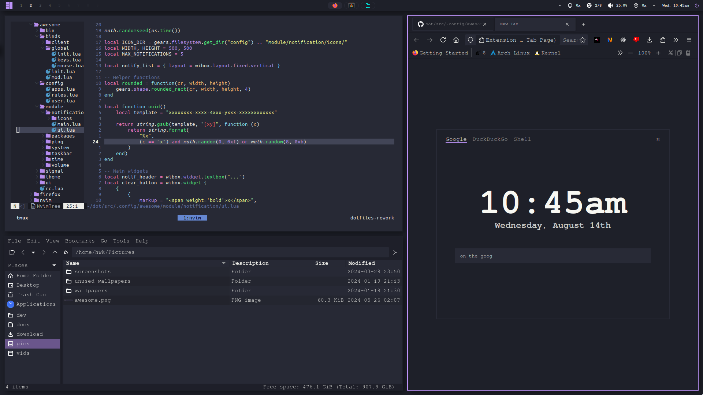

# ~/dot

 

<p align="center">
    
</p>

## Usage

Requires [yolk](https://elkowar.github.io/yolk/).

- **Applications**: [yolk.rhai](yolk.rhai)
- **Themes**: [colors.rhai](colors.rhai)
- **Hosts**: [hosts.rhai](hosts.rhai)

```sh
$ yolk help
$ yolk sync
```

## License

[MIT](LICENSE)

